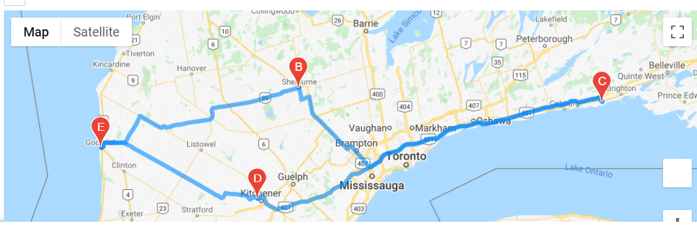

# World_Weather_Analysis
 
 ### Module 6 World Weather Analysis
 **Deliverable1:** [Deliverable 1](Weather_Database.ipynb) 
 **Deliverable2:** [Deliverable 2](Vacation_Search.ipynb) 
 **Deliverable3:** [Deliverable 3](Vacation_Itinerary.ipynb) 

 ## Overview of World Weather Analysis:
 1. In deliverable 1 the OpenWeatherMap API was accessed and 2000 random latidudes and logitudes were obtained and using the citipy module the nearest citys with all the relevant information was added to a new dataframe and exported.
 
 2. In deliverable 2 the csv file from deliverable 1 is used so we could add a hotel section in our new dataframe including the previous data and to apply the googlemaps api to create a figure.

   

 3. In deliverable 3 using the csv from deliverable 2 the google directions api is used to add a directions layer to the figure.

    

